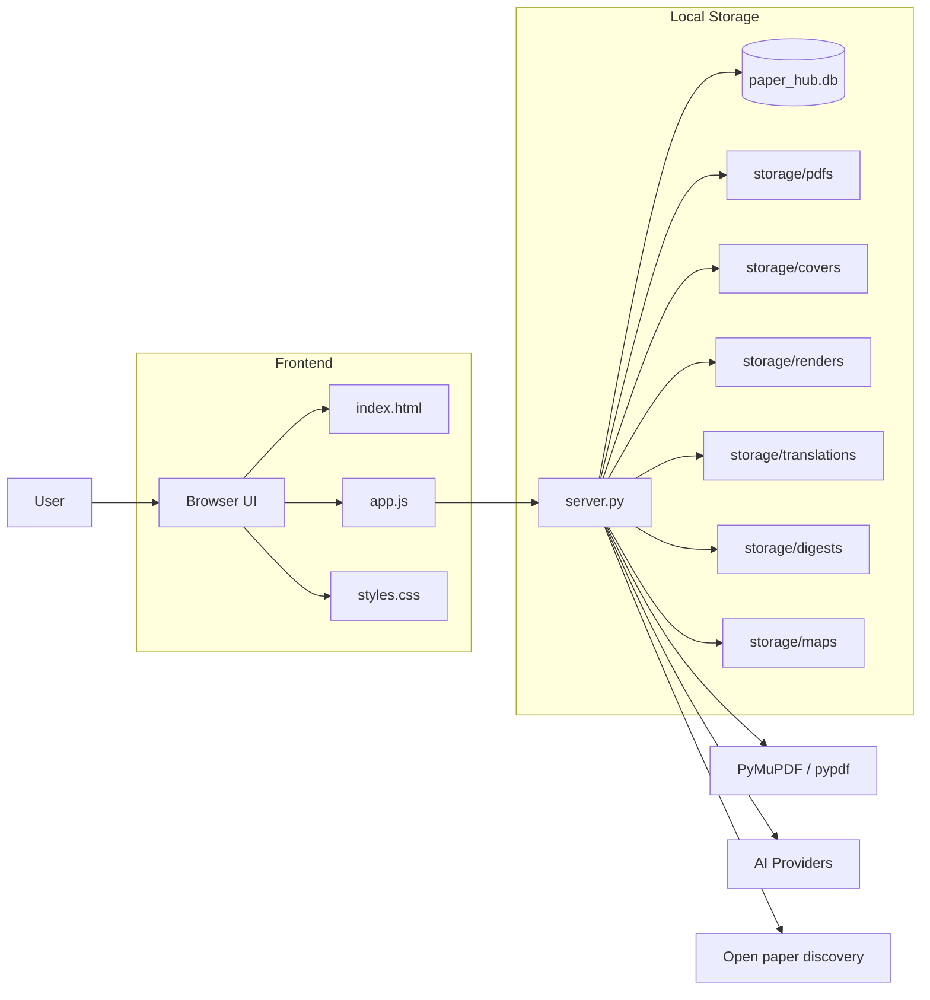

# Paper Hub

> A local-first paper workspace for importing, reading, summarizing, and mapping your research library.

[](https://www.python.org/)
[](https://www.sqlite.org/)
[](#)
[](#)

Paper Hub is built for one job: make your paper library usable every day.

Instead of scattering PDFs across download folders, browser bookmarks, note apps, and one-off AI chats, Paper Hub keeps the whole workflow in one local workspace:

- import PDF papers
- organize metadata and notes
- read inside the app
- generate AI summaries and digests
- explore a library-wide knowledge map
- discover related papers by topic

## Why It Exists

Most tools only solve one slice of the paper workflow.

- Reference managers store metadata but feel detached from reading
- Note apps store thoughts but not the paper itself
- AI chats summarize content but do not build a persistent library
- Download folders become a graveyard of unnamed PDFs

Paper Hub treats the library itself as the product.

## What It Does

| Module | What you get |
| --- | --- |
| Paper Library | Grid/list browsing, favorites, filters, tags, collections, ratings, priorities |
| PDF Import | Local PDF upload, metadata extraction, cover generation, project-local storage |
| In-App Reader | Read papers inside the app with progress tracking and page state |
| AI Enrichment | Chinese title, AI summary, keywords, category, collection suggestions |
| Digest | Abstract / Method / Conclusion highlights with readable takeaways |
| Topic Discovery | Search by research topic and pull in open papers automatically |
| Knowledge Map | Mind-map and graph views across the full library or the selected paper |
| Export | Export current library data to JSON |

## Product Shape



## Experience Highlights

### 1. Local-first by default

- SQLite for library metadata
- project-local storage for PDFs, covers, digests, translations, and map caches
- no SaaS dashboard required

### 2. Reading is not an afterthought

- open a paper directly in the app
- keep reading progress and page state
- move between original text, translated reading, and embedded translation views

### 3. AI is attached to your library

- enrich metadata in-place
- keep summaries and digests linked to the paper
- build reusable structure over time instead of one-off outputs

### 4. Discovery feeds the library

- enter a topic
- search open papers
- score relevance
- import recommended items into the same workspace

## Quick Start

### Requirements

- Python 3.10+

### Install dependencies

```powershell
pip install pymupdf pypdf
```

### Configure AI

Optional, but recommended if you want summaries, digests, translation workflows, and better topic discovery.

```powershell
Copy-Item .env.example .env
```

Example:

```env
AI_PROVIDER=openai
AI_API_KEY=your_api_key
AI_MODEL=gpt-5-mini
AI_API_URL=
```

You can also configure providers from the in-app `AI Provider` panel.

### Run

```powershell
python server.py
```

Or on Windows:

```text
start.bat
```

Then open:

```text
http://127.0.0.1:8876
```

## Typical Workflow

1. Import a PDF into the local library
2. Let Paper Hub extract metadata and create a cover
3. Run AI enrichment for title, summary, and keywords
4. Read inside the app and save notes
5. Open the digest for fast recall
6. Use the knowledge map to see topic structure
7. Run topic discovery when you want to expand the library

## AI Provider Support

Paper Hub supports multiple provider styles, including:

- OpenAI
- Anthropic
- Gemini
- OpenRouter
- Groq
- GLM
- Qwen / DashScope
- DeepSeek
- Azure OpenAI
- Ollama
- LM Studio
- OpenAI-compatible relays

## Project Layout

```text
paper-hub/
- index.html
- app.js
- styles.css
- server.py
- paper_hub.db
- provider_config.json
- storage/
  - pdfs/
  - covers/
  - renders/
  - translations/
  - digests/
  - maps/
- docs/
```

## Data Storage

By default, Paper Hub keeps data in the project directory:

- `paper_hub.db`: library metadata
- `storage/pdfs/`: imported papers
- `storage/covers/`: generated covers
- `storage/renders/`: rendered reader pages
- `storage/translations/`: cached translation results
- `storage/digests/`: paper digest cache
- `storage/maps/`: knowledge map cache

This makes backup, migration, and local ownership straightforward.

## Troubleshooting

### The page does not work when double-clicking `index.html`

Do not open the HTML file directly. Start the local server first:

```powershell
python server.py
```

### AI features are unavailable

Check:

- `.env`
- the in-app `AI Provider` panel
- whether the selected model and API URL are valid
- whether your current network can reach the provider

### Topic discovery is weak for Chinese queries

If AI is not configured, the app cannot rewrite Chinese topics into stronger academic search queries. For better results:

- configure an AI provider
- or search with English research terms directly

## Roadmap

- multi-source academic search beyond the current open paper flow
- BibTeX / RIS import and export
- more granular full-text search
- better backup and sync workflows
- richer cross-paper clustering and recommendation logic

## License

If you plan to distribute the project publicly, add a `LICENSE` file before release.
