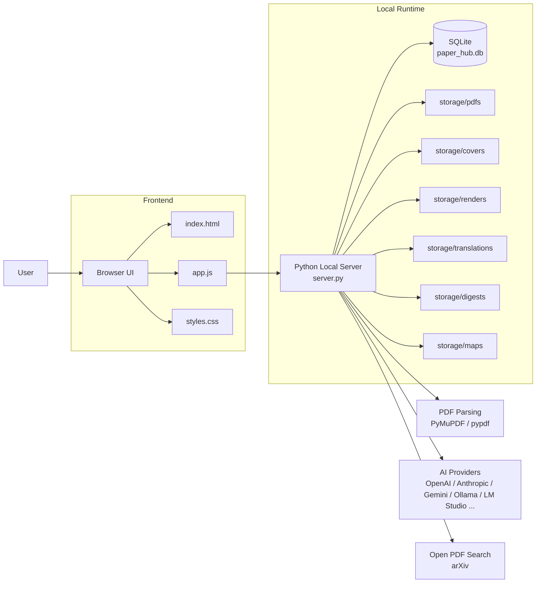
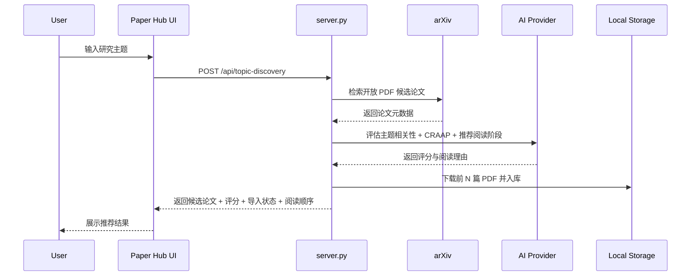

# Paper Hub

> Your local AI paper workbench.

Paper Hub 是一个本地运行的论文阅读与整理工具。  
它把 PDF 导入、AI 元数据整理、应用内阅读、中文翻译、论文 Digest、知识地图、主题发现下载放进同一个界面里，适合个人研究者、学生和独立开发者在自己的电脑上建立论文库。

## Why Paper Hub

如果你平时会遇到这些问题：

- 论文散落在下载目录、浏览器收藏夹、网盘和笔记软件里
- PDF 下载了很多，但很难形成稳定的阅读顺序
- 想快速得到中文摘要、重点结论和方法脉络
- 想围绕某个主题批量找论文，而不是一篇篇手动搜

这个项目就是为这些场景准备的。

## What It Can Do

- 导入本地 PDF，自动提取标题、摘要、标签和封面
- 用 AI 整理论文元数据：中文标题、中文摘要、标签、分类、合集
- 在应用内直接阅读 PDF，并保存阅读进度
- 支持中文精读、嵌入翻译、全文翻译任务
- 生成论文 Digest：`Abstract / Method / Conclusion`
- 生成全库知识地图：思维导图 + 知识图谱
- 输入研究主题，自动检索开放 PDF，AI 评估 CRAAP，并推荐阅读顺序
- 数据全部保存在本地，默认使用 SQLite + 本地文件存储

## Architecture

### Overall Architecture



### Topic Discovery Flow



## Quick Start

### 1. Install Dependencies

需要 Python 3.10+。

```powershell
pip install pymupdf pypdf
```

### 2. Configure AI

复制环境变量模板：

```powershell
Copy-Item .env.example .env
```

然后填写你自己的配置，例如：

```env
AI_PROVIDER=openai
AI_API_KEY=your_api_key
AI_MODEL=gpt-5-mini
AI_API_URL=
```

也可以不写 `.env`，启动后在页面右上角的 `AI Provider` 面板里配置。

### 3. Run

```powershell
python server.py
```

或者在 Windows 上直接双击：

```text
start.bat
```

打开浏览器访问：

```text
http://127.0.0.1:8876
```

## User Guide

### Import a PDF

1. 点击 `导入 PDF`
2. 选择你的本地论文文件
3. 等待系统自动提取标题、摘要、标签和封面

### Organize With AI

1. 在论文库中选中一篇论文
2. 点击 `AI 整理`
3. 系统会补全：
   - 中文标题
   - 中文摘要
   - 标签
   - 分类
   - 合集
   - 阅读优先级

### Read Inside the App

选中带本地 PDF 的论文后，点击 `在应用内阅读`。

你可以切换三种模式：

- `原文`
- `中文精读`
- `嵌入翻译`

系统会自动记录阅读进度和上次阅读位置。

### Generate a Paper Digest

点击 `论文精华`，系统会生成：

- Abstract 精读
- Method 精读
- Conclusion 精读
- 中文要点列表

### Explore the Knowledge Map

点击 `知识地图`，你可以从两个角度查看论文库：

- 全库视角
- 当前论文视角

并且可以在两种图之间切换：

- 思维导图
- 知识图谱

### Discover Papers by Topic

点击 `主题发现`，输入研究主题，例如：

- `RAG evaluation`
- `multimodal retrieval`
- `multi-agent planning`
- `多模态检索增强生成`

系统会自动：

1. 检索开放可下载的 PDF
2. 用 AI 评估与主题的语义相关性
3. 按 CRAAP 给出优先级
4. 推荐阅读顺序
5. 自动下载前 N 篇并导入本地论文库

说明：

- 这里的“相关性”是按主题语义判断，不要求论文标题逐字匹配输入主题
- 如果 AI 不可用，会自动回退到本地启发式评分
- 当前主题发现默认使用 arXiv 作为开放 PDF 来源

## Data Storage

Paper Hub 默认把数据保存在项目目录里：

- `paper_hub.db`：论文元数据数据库
- `storage/pdfs/`：本地 PDF
- `storage/covers/`：封面
- `storage/renders/`：阅读器页面渲染图
- `storage/translations/`：翻译缓存
- `storage/digests/`：Digest 缓存
- `storage/maps/`：知识地图缓存

这意味着：

- 数据不会默认上传到云端
- 迁移项目目录即可迁移大部分数据
- 公开仓库时不要提交这些运行时文件

## Supported AI Providers

项目内置多种 Provider 适配，包括：

- OpenAI
- Anthropic
- Gemini
- OpenRouter
- Groq
- GLM
- Qwen / DashScope
- DeepSeek
- Azure OpenAI
- Ollama
- LM Studio
- OpenAI-compatible relay

## Troubleshooting

### The page does not work when I double-click `index.html`

不要直接打开 HTML 文件。  
先运行本地服务：

```powershell
python server.py
```

### AI features are unavailable

通常是下面几个原因：

- 没有配置 API key
- Provider 端点不正确
- 模型名不正确
- 当前网络无法访问模型服务

优先检查：

- `.env`
- 页面中的 `AI Provider` 设置面板

### Topic discovery is weak for Chinese queries

如果没有启用 AI，系统无法先把中文主题改写成更适合学术检索的英文查询，召回效果会下降。  
更稳定的做法：

- 配置 AI Provider
- 或者直接使用英文研究主题

## Public Release Checklist

如果你要把这个项目公开发布到 GitHub，请先确认：

- `.env` 不包含真实密钥
- `provider_config.json` 不包含真实密钥
- 没有提交本地数据库
- 没有提交个人 PDF、渲染图、翻译缓存和 Digest 缓存
- `.gitignore` 已忽略运行时文件

## Roadmap Ideas

- OpenAlex / Semantic Scholar / Crossref 多源检索
- 手动勾选主题发现结果后再导入
- BibTeX / RIS 导入导出
- 更细粒度的全文搜索
- 多设备同步或备份

## License

如果准备正式公开发布，建议补充 `LICENSE` 文件。
